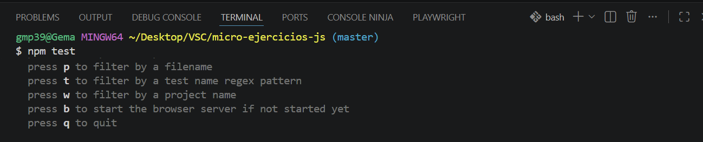

# Ejercicio 01 — Contains English

## Descripción
Función que determina si una cadena de texto contiene la palabra "English",
sin importar si está en mayúsculas o minúsculas.

## Algoritmo

1. **Recibir** la cadena de texto como parámetro.
2. **Convertir** toda la cadena a minúsculas con `.toLowerCase()`,
   para que "ENGLISH", "eNgLiSh" y "english" sean equivalentes.
3. **Buscar** si la cadena resultante contiene la subcadena `"english"`
   usando el método `.includes()`.
4. **Devolver** el booleano que retorna `.includes()`:
   `true` si la encuentra, `false` si no.

## Casos de uso

  Entrada              Salida  
 _____________________________
  "abcEnglishdef"______true    
  "eNgLiSh is fun"_____true    
  "abcnEglishsef"______false   npm
  "Hello world"________false   
  "" __________________false   

## Cómo ejecutar los tests
npm test

## Captura de los tests pasando
